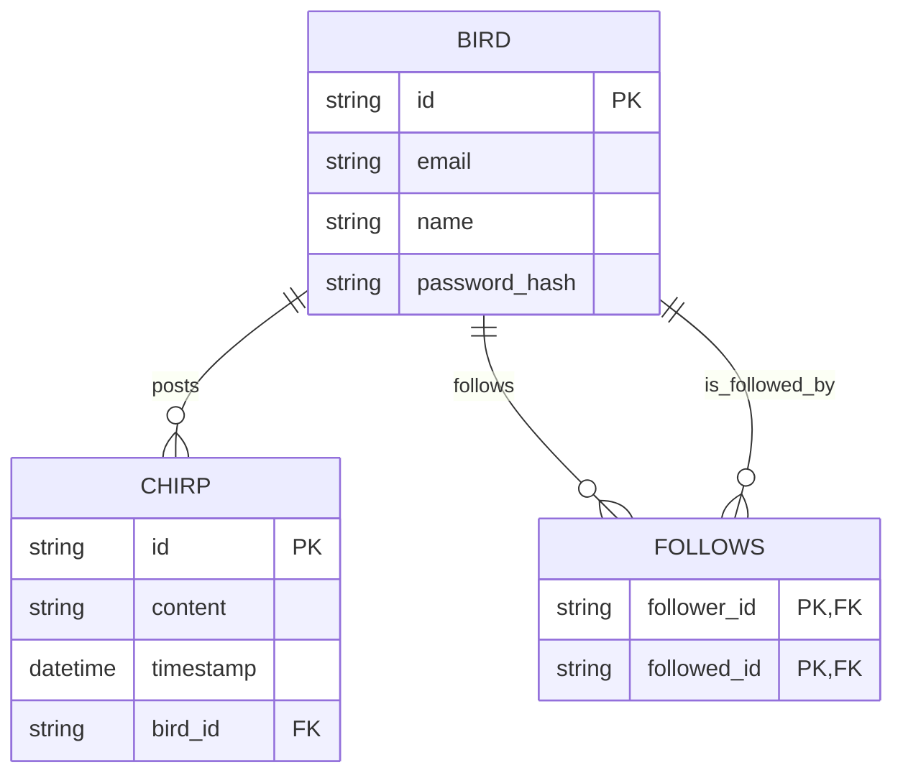

**Groups:** This assignment will be completed in your pre-assigned groups from the beginning of the semester.

During the tutorial, each group will be called to the front of the classroom. Each group will be asked a question that is related
to the following scenario.

## **Scenario: Chirper** 
Chirper is a fictitious, real-time microblogging service that emerged to fill a void in the social media landscape following the disappearance of Twitter. Birds can post Chirps and follow other Birds to receive a curated feed of their content.

In addition, Chirper is getting huge traction. They have just crossed 1 million daily active users and 5 million daily tweets. Furthermore, on average, there are 100 followers per Bird, and the most popular bird, @paco, has gathered 2 million followers.

**The Data Model**

Chirper uses a simple 3-table data model to store application data, following the business rules below:

* A Bird can follow many Birds.  
* A Bird can post a Chirp.

### **Grading and Evaluation**

Your answers will be graded by the Teaching Assistants (TAs) based on their comprehensiveness, accuracy, and demonstrated understanding of architectural principles.

To ensure fair and consistent marking, the question and answer session for each group will be audio-recorded. This will allow for later review and arbitration on marks if necessary.

